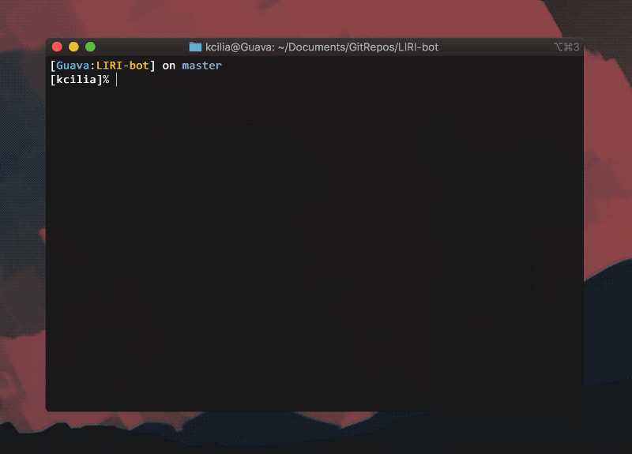

## LIRI-bot

  

A lightweight language interpretation and recognition interface (LIRI!).

  

Utilizes Node, Axios, Bands in Town Artists API, and Spotify API.

  

- You will need your own Spotify ID and secret ID to run this.

- Recommended to put these in .env and import them so they are inaccessible.

  

**Commands are the following:**

spotify-this-song [music search]

 - Will output a list of songs based on the artist or song searched
 - iTerm2 will give a clickable preview link
 - Other terminal emulators will provide a link that can be copied

movie-this [movie search]

 - Will output a movie, the date released, IMDB and Rotten Tomatoes ratings, the country produced in, available languages, synopsis, and notable actors

concert-this [artist search]

 - Will output a list of upcoming shows for a particular artist

do-what-it-says

- Takes in text from a ./random.txt and attempts to parse a command. Will perform whatever command is in the file (so long as it's listed above :P)

